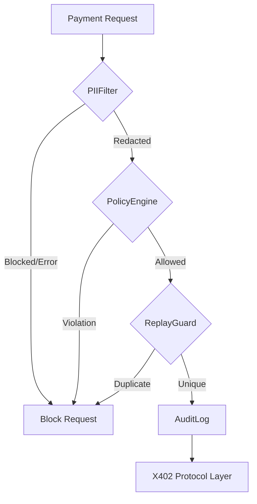

# Technical Deep Dive: PII Filtering & Security

## 1. PII Detection Mechanism
The system utilizes **Microsoft Presidio**, combining two detection modes:
- **Regex (Rule-based)**: Perfect for structural data like IBANs, Credit Cards, and SSNs.
- **NLP (Context-based)**: Uses spaCy's `en_core_web_sm` model for entities like `PERSON`.

### The "PERSON" Detection Challenge
The paper identifies a significant gap in detecting names within URL paths. 
- **Contextual Detection**: Works well in free-text (e.g., "Payment for John Smith").
- **Slug Detection**: Fails in URLs (e.g., `/patient/john-smith/export`) because NER models rely on grammatical context, which is absent in slugs.
- **Result**: Recall for `PERSON` is only ~55%, meaning nearly half of names in URLs might be missed without additional heuristics.

## 2. Spending Policy (PolicyEngine)
To prevent "wallet drain" attacks, the middleware implements three hard ceilings:
- **max_per_call_usd**: Prevents a single inflated price from draining the wallet.
- **daily_limit_usd**: A rolling 24-hour aggregate cap.
- **max_per_endpoint_usd**: Limits exposure to any single untrusted server.

## 3. Replay Protection (ReplayGuard)
Since x402 tokens are bearer credentials, they can be stolen and resubmitted.
- **Mechanism**: Computes an `HMAC-SHA256` fingerprint of the payment token.
- **Storage**: Uses a TTL-bounded deduplication store (In-memory or Redis).
- **Action**: If a fingerprint is repeated within the TTL window, the request is blocked.

## 4. Tamper-Evident Audit Log
The `AuditLog` doesn't just log events; it ensures the log itself hasn't been altered.
- **HMAC Chaining**: Each log entry contains an HMAC of the previous entry.
- **Verification**: If any entry is deleted or modified, the chain is broken, alerting auditors to tampering.

### Security Control Pipeline

