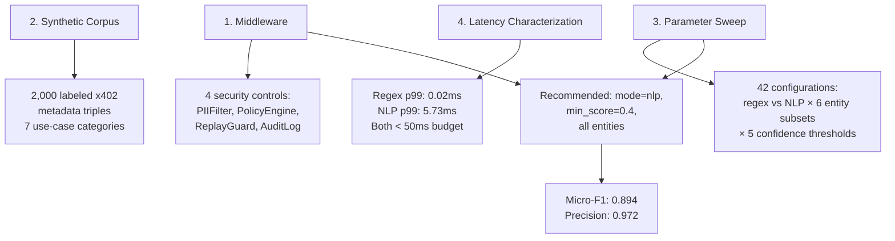

# 📋 Abstract & Core Contributions

## Original Abstract (Condensed)
AI agents using the x402 micropayment protocol embed payment metadata (resource URLs, descriptions, reason strings) in every HTTP payment request. This metadata is transmitted to payment servers and centralized facilitator APIs *before* on-chain settlement—neither typically bound by data processing agreements. 

**presidio-hardened-x402** is the first open-source middleware that:
1. ✅ Intercepts x402 requests pre-transmission
2. ✅ Detects & redacts PII using Microsoft Presidio
3. ✅ Enforces declarative spending policies
4. ✅ Blocks duplicate replay attempts

## 🏆 Four Core Contributions

## 🎯 Why This Matters
| Problem | Consequence | Solution |
|---------|------------|----------|
| x402 metadata contains PII (emails, names, SSNs) | GDPR violations, data leakage to unbound third parties | Pre-execution PII redaction |
| No spending limits in protocol | Wallet drain via malicious pricing | Declarative policy engine |
| Signed tokens are bearer credentials | Replay attacks, double-charging | HMAC-SHA256 replay detection |
| No audit trail | Impossible to demonstrate compliance | Structured JSON-L audit logging |

> 💡 **Key Insight**: *"The infrastructure was designed for financial settlement, not for privacy."* Pre-execution controls—not post-hoc monitoring—are the architecturally sound response.
