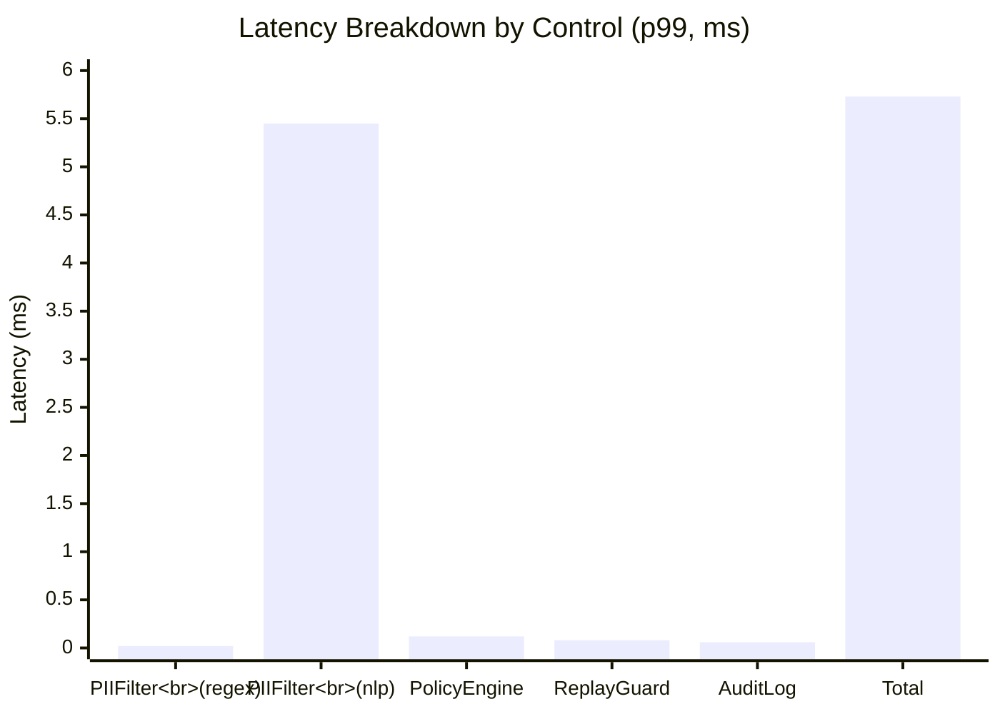

# 🏆 Core Contributions Detailed

## Contribution 1: Open-Source Middleware
```python
# Drop-in replacement for Coinbase x402 client
from presidio_hardened_x402 import HardenedX402Client

client = HardenedX402Client(
    facilitator_address="0x...",
    pii_config={"mode": "nlp", "min_score": 0.4},
    policy_config={"max_per_call_usd": 5.0}
)
```

**Four Sequential Controls**:
1. `PIIFilter`: Presidio-based PII detection & redaction
2. `PolicyEngine`: Declarative spending limit enforcement  
3. `ReplayGuard`: HMAC-SHA256 duplicate request detection
4. `AuditLog`: Tamper-evident JSON-L event streaming

## Contribution 2: Synthetic Corpus (2,000 Samples)
```mermaid
graph LR
    subgraph Generation["Corpus Construction"]
        T1[7 Use-Case Templates] --> T2[Medical, Finance,<br/>E-commerce, Research,<br/>Legal, Education, General]
        T2 --> T3[Entity Injection Engine]
        T3 --> T4[Surface Form Variants:<br/>• bare/email@example.com<br/>• URL-encoded/email%40example.com<br/>• Query param?user=email@example.com]
        T4 --> T5[2,000 labeled triples:<br/>(resource_url, description, reason)]
    end
```

**Entity Distribution**:
| Entity Type | Count | % of Total | Primary Field |
|-------------|-------|------------|---------------|
| EMAIL_ADDRESS | 312 | 35.7% | resource_url |
| PERSON | 322 | 36.8% | description |
| US_SSN | 45 | 5.1% | reason |
| IBAN_CODE | 67 | 7.7% | resource_url |
| PHONE_NUMBER | 89 | 10.2% | description |
| CREDIT_CARD | 40 | 4.6% | reason (edge) |

## Contribution 3: 42-Configuration Parameter Sweep
**Experimental Dimensions**:
- Detection Mode: `regex` vs `nlp` (spaCy)
- Entity Subsets: 6 individual types + all-combined (7 options)
- Confidence Thresholds: `min_score ∈ {0.3, 0.4, 0.5, 0.6, 0.7}`

**Key Finding**: 
```
Recommended Config: mode=nlp, min_score=0.4, all entities
→ Micro-F1: 0.894 | Precision: 0.972 | Recall: 0.827
→ p99 Latency: 5.73ms (well under 50ms x402 budget)
```

## Contribution 4: Latency Characterization


> ✅ All configurations operate within x402's 50ms latency budget  
> ✅ NLP overhead (5.71ms) buys +20pp recall—cost-effective insurance
