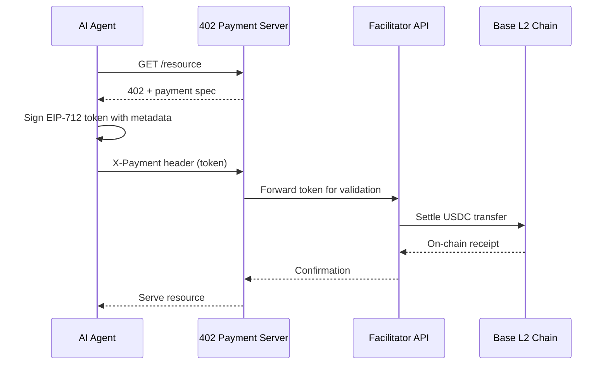

# ❓ The x402 Privacy Gap

## Protocol Mechanics (Brief)


## The Privacy Problem
The `X-Payment` header contains structured metadata:
```json
{
  "resource_url": "https://api.example.com/user/alice@example.com/export",
  "description": "Export records for Alice Martin",
  "reason": "User requested data export",
  "amount": "0.50",
  "token": "0xsigned..."
}
```

**Critical Issue**: `resource_url`, `description`, and `reason` may contain:
- 📧 Email addresses
- 👤 Full names / usernames  
- 🆔 SSNs, IBANs, phone numbers
- 💳 Credit card numbers (in edge cases)

## Why This Is a Compliance Risk
1. **No DPA Coverage**: Payment servers and facilitator APIs are typically not bound by Data Processing Agreements with the agent operator
2. **Pre-Settlement Transmission**: PII is transmitted *before* on-chain settlement, to centralized infrastructure
3. **Bearer Token Design**: Signed tokens can be replayed or intercepted; metadata is not encrypted
4. **No Redaction Primitive**: Protocol assumes metadata is non-sensitive

## Threat Model Summary
| Actor | Capability | Risk Mitigated by Hardened Client |
|-------|-----------|-----------------------------------|
| Malicious endpoint | Inflated pricing, PII harvesting | PolicyEngine limits spending; PIIFilter redacts before transmission |
| Network adversary | Token interception, replay | ReplayGuard detects duplicates via HMAC-SHA256 |
| Compromised facilitator | Metadata logging, exfiltration | PIIFilter ensures only redacted metadata leaves trust boundary |
| Insider threat | Audit log tampering | AuditLog uses HMAC chaining for tamper-evidence |

> 🔐 **Design Principle**: *"Never trust metadata. Always filter before transmission."*
