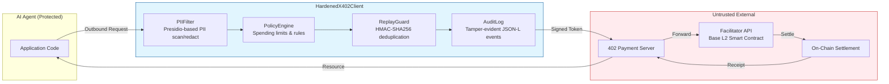
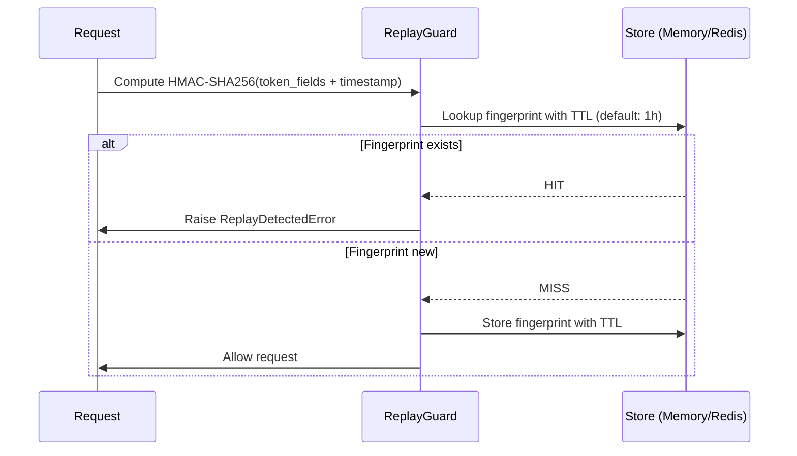

# 🏗️ System Architecture & Control Pipeline

## HardenedX402Client: Drop-in Python Wrapper



## The Four Security Controls (Applied Sequentially)

### 1️⃣ PIIFilter: Pre-Transmission PII Redaction
```python
# Pseudocode: Control flow
def scan_and_redact(metadata_fields: dict) -> dict:
    for field in ['resource_url', 'description', 'reason']:
        results = presidio_analyzer.analyze(
            text=metadata_fields[field],
            entities=ENTITY_TYPES,
            language='en'
        )
        for result in results:
            if result.score >= min_score:
                metadata_fields[field] = redact_span(
                    metadata_fields[field], 
                    result.start, result.end,
                    placeholder=f"<REDACTED:{result.entity_type}>"
                )
                emit_audit_event("PII_REDACTED", entity=result.entity_type)
    return metadata_fields
```

**Entity Types Supported**:
| Entity | Regex Pattern | NLP Context | Surface Forms Tested |
|--------|--------------|-------------|---------------------|
| `EMAIL_ADDRESS` | ✅ RFC 5322 | ❌ | bare, URL-encoded, query param |
| `PERSON` | ❌ | ✅ spaCy NER | full name, slug, abbrev., last-first |
| `US_SSN` | ✅ `XXX-XX-XXXX` | ❌ | dashes, compact |
| `IBAN_CODE` | ✅ ISO 13616 | ❌ | DE/GB canonical formats |
| `PHONE_NUMBER` | ✅ US formats | ✅ contextual | US formats, intl. compact |
| `CREDIT_CARD` | ✅ Luhn check | ❌ | Visa/Mastercard 16-digit |

### 2️⃣ PolicyEngine: Declarative Spending Controls
```yaml
# Example policy configuration (YAML)
spending_policy:
  max_per_call_usd: 5.00
  daily_limit_usd: 50.00
  max_per_endpoint_usd: 25.00
  allowed_facilitators:
    - "0x123...abc"
  blocked_domains:
    - "malicious-api.example.com"
```

**Violation Handling**: Raises `PolicyViolationError`, emits `POLICY_BLOCKED` audit event, request blocked (fail-safe).

### 3️⃣ ReplayGuard: Duplicate Request Detection


### 4️⃣ AuditLog: Tamper-Evident Event Stream
```json
{
  "timestamp": "2026-04-15T14:30:22.123Z",
  "agent_id": "agent-7f3a9b",
  "resource_url": "https://api.example.com/<REDACTED:EMAIL>/export",
  "controls": {
    "pii_filter": {"status": "redacted", "entities": ["EMAIL_ADDRESS"]},
    "policy_engine": {"status": "allowed", "remaining_daily": "$42.15"},
    "replay_guard": {"status": "new", "fingerprint": "a1b2c3..."}
  },
  "outcome": "ALLOWED",
  "audit_chain": {
    "prev_hash": "9f8e7d...",
    "current_hash": "3c4b5a...",
    "signature": "HMAC(prev_hash || current_entry)"
  }
}
```

## 🔐 Design Principles

| Principle | Implementation | Rationale |
|-----------|---------------|-----------|
| **Fail-safe over fail-open** | Exceptions block requests; Redis timeout → memory fallback | False block = delayed payment; False pass = GDPR liability |
| **Zero-trust metadata** | Scan *every* field on *every* request | Protocol doesn't constrain metadata content |
| **Observable by default** | Every control decision emits structured audit event | Compliance demonstration requires reconstructable trails |
