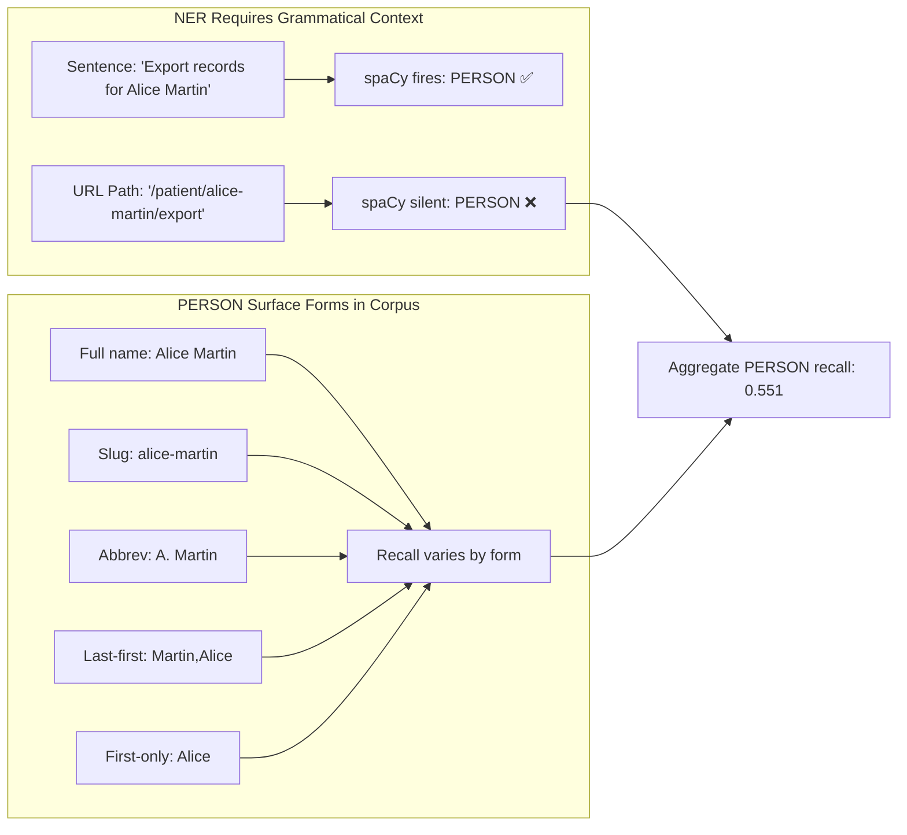

# 🔍 PII Detection: Presidio Integration Deep Dive

## Microsoft Presidio Architecture
```mermaid
graph LR
    subgraph Presidio["Presidio Analyzer"]
        A[Input Text] --> B[Preprocessing]
        B --> C[Regex Recognizers]
        B --> D[NLP Recognizers<br/>(spaCy)]
        C --> E[Score Aggregation]
        D --> E
        E --> F[Entity Results:<br/>type, start, end, score]
    end
    
    F --> G[Presidio Anonymizer]
    G --> H[Redacted Output:<br/>placeholder tokens]
```

## Configuration Options
```python
pii_config = {
    "mode": "nlp",              # 'regex' | 'nlp' | 'hybrid'
    "min_score": 0.4,           # Confidence threshold [0.0-1.0]
    "entities": [               # Entity types to detect
        "EMAIL_ADDRESS",
        "PERSON", 
        "US_SSN",
        "IBAN_CODE",
        "PHONE_NUMBER",
        "CREDIT_CARD"
    ],
    "language": "en",           # NLP model language
    "custom_recognizers": []    # Optional: domain-specific patterns
}
```

## Entity Detection Performance (min_score=0.4)
| Entity | Regex P/R/F1 | NLP P/R/F1 | Notes |
|--------|--------------|------------|-------|
| EMAIL_ADDRESS | 1.000/1.000/1.000 | 1.000/1.000/1.000 | Structural pattern = perfect detection |
| PERSON | 0.000/0.000/0.000 | 0.894/0.551/0.682 | NLP required; recall limited by URL context |
| US_SSN | 1.000/1.000/1.000 | 1.000/0.918/0.957 | Regex sufficient; NLP slight recall dip |
| PHONE_NUMBER | 1.000/0.781/0.877 | 1.000/1.000/1.000 | NLP recovers compact intl. format |
| IBAN_CODE | 1.000/1.000/1.000 | 1.000/1.000/1.000 | Structural pattern = perfect |
| CREDIT_CARD | 1.000/1.000/1.000 | 1.000/1.000/1.000 | Luhn check + regex = perfect |

## The PERSON Detection Challenge


**Mitigation Strategies**:
1. Slug-aware preprocessing: split on `-`, `_`, `.` before NER
2. Domain-adapted NER fine-tuning on x402 metadata
3. Manual review workflows for high-risk categories
4. Hybrid approach: regex for structural patterns + NLP for names

## Extending Recognizers
```python
from presidio_analyzer import PatternRecognizer, Pattern

# Custom recognizer for internal employee IDs
employee_recognizer = PatternRecognizer(
    supported_entity="EMPLOYEE_ID",
    patterns=[
        Pattern(name="emp_id", regex=r"EMP-\d{6}", score=0.95)
    ],
    context=["employee", "staff", "worker"]
)

# Register with Presidio
registry = RecognizerRegistry()
registry.add_recognizer(employee_recognizer)

# Pass to HardenedX402Client
client = HardenedX402Client(
    pii_config={"custom_registry": registry}
)
```
