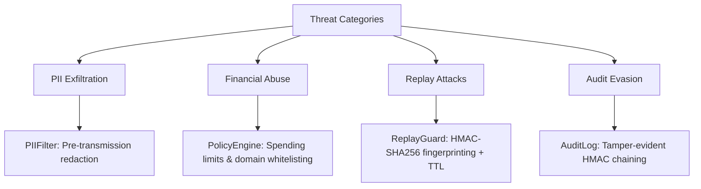

# 🛡️ Threat Model & Attack Mitigations

## Threat Categories Addressed


## Attack Scenarios & Mitigations

### Scenario 1: Malicious API Endpoint Harvests PII
**Attack**: 
- Attacker operates `api.malicious.io` that returns inflated pricing
- Agent sends payment with `reason: "User alice@example.com export"`
- Payment server/facilitator logs full metadata

**Mitigation**:
```python
# PIIFilter redacts before transmission
metadata = {
    "reason": "User <REDACTED:EMAIL_ADDRESS> export"  # ✅ PII never leaves agent
}
# PolicyEngine blocks over-limit pricing
if amount > policy.max_per_call:
    raise PolicyViolationError()  # ✅ Wallet protected
```

### Scenario 2: Token Interception & Replay
**Attack**:
- Network adversary captures valid `X-Payment` token
- Replays token to charge wallet multiple times

**Mitigation**:
```python
# ReplayGuard computes fingerprint
fingerprint = hmac_sha256(
    key=HMAC_KEY,
    data=f"{resource_url}:{amount}:{timestamp}"
)
# Check against store with TTL
if fingerprint in replay_store and not expired:
    raise ReplayDetectedError()  # ✅ Duplicate blocked
```

### Scenario 3: Compromised Facilitator Logs PII
**Attack**:
- Facilitator operator logs all payment metadata
- Logs contain unredacted PII from agent requests

**Mitigation**:
```mermaid
graph LR
    A[Agent] -->|1. Scan & Redact| B[PIIFilter]
    B -->|2. Only Redacted Metadata| C[Sign Token]
    C -->|3. Transmit| D[Facilitator]
    D -->|4. Logs| E[<REDACTED:EMAIL_ADDRESS>]  # ✅ No PII in logs
```

### Scenario 4: Insider Tampering with Audit Logs
**Attack**:
- Malicious insider modifies audit logs to hide policy violations

**Mitigation**:
```json
{
  "audit_chain": {
    "prev_hash": "9f8e7d...",
    "current_hash": "3c4b5a...",
    "signature": "HMAC(prev_hash || current_entry || secret_key)"
  }
}
```
- Each entry cryptographically linked to previous
- Tampering breaks chain validation
- Secret key stored in HSM/secrets manager

## Out-of-Scope Threats (Future Work)
| Threat | Why Out of Scope | Planned Mitigation |
|--------|-----------------|-------------------|
| Base64/obfuscated PII | Requires decoding heuristics | v0.3.0: Obfuscation detector module |
| Unicode homoglyph attacks | Complex normalization needed | v0.3.0: Unicode-aware preprocessing |
| Multi-party collusion | Requires protocol-level changes | Research: Threshold signature schemes |
| Side-channel timing attacks | Orthogonal to metadata filtering | Deployment: Constant-time implementations |

## Security Assumptions
✅ Agent runtime environment is trusted  
✅ HMAC replay key is securely managed  
✅ Presidio models are up-to-date with PII patterns  
✅ Audit log storage is append-only (WORM)  

❌ Payment server/facilitator are *not* trusted with PII  
❌ Network is adversarial (tokens can be intercepted)  
❌ Metadata content is untrusted (zero-trust design)
