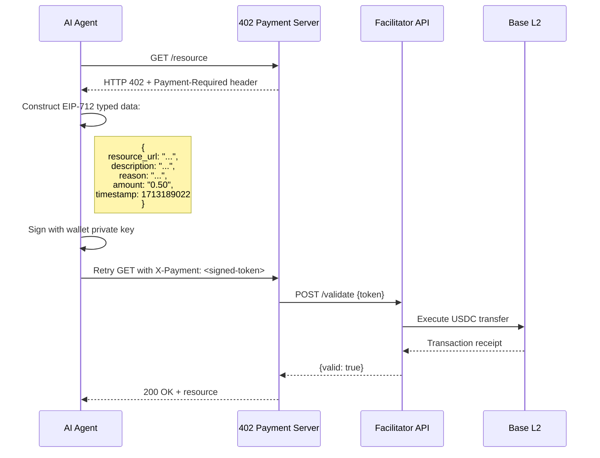
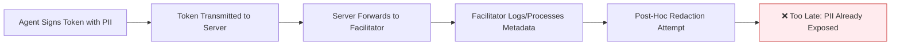

# 🔗 x402 Protocol Mechanics

## Protocol Flow (Standard)


## Metadata Fields at Risk
| Field | Typical Content | PII Risk Examples |
|-------|----------------|-------------------|
| `resource_url` | API endpoint path | `/patient/alice.martin%40corp.io/export` |
| `description` | Human-readable purpose | "Export records for Alice Martin" |
| `reason` | Business justification | "User alice@example.com requested GDPR export" |

## EIP-712 Typed Data Structure
```json
{
  "types": {
    "Payment": [
      {"name": "resource_url", "type": "string"},
      {"name": "description", "type": "string"},
      {"name": "reason", "type": "string"},
      {"name": "amount", "type": "uint256"},
      {"name": "timestamp", "type": "uint256"}
    ]
  },
  "primaryType": "Payment",
  "domain": {"name": "x402", "version": "1", "chainId": 8453},
  "message": { ... }
}
```

> ⚠️ **Critical**: The `message` object is signed *as-is*. If it contains PII, that PII is cryptographically bound to the payment token and transmitted to all downstream parties.

## Why Post-Hoc Redaction Doesn't Work


**Architectural Solution**: Intercept and filter *before* signing and transmission.
