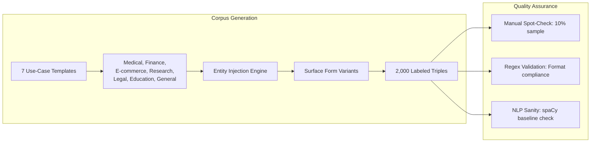
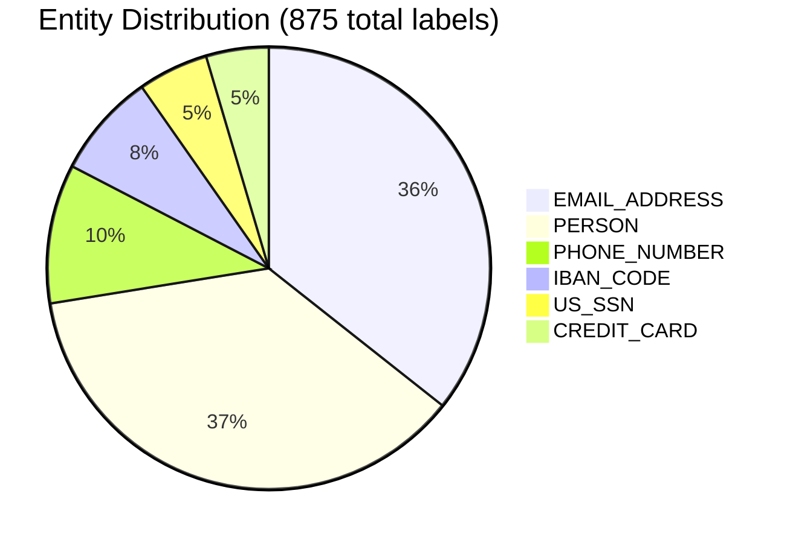

# 🧪 Synthetic Corpus Construction

## Generation Pipeline


## Use-Case Templates
| Category | Example resource_url | Example description | PII Types Injected |
|----------|---------------------|-------------------|-------------------|
| Medical | `/patient/{EMAIL}/records` | "Export EHR for {PERSON}" | EMAIL, PERSON, SSN |
| Finance | `/account/{IBAN}/statement` | "Statement for {PERSON}" | IBAN, PERSON, PHONE |
| E-commerce | `/user/{EMAIL}/order/{CC}` | "Order confirmation" | EMAIL, CREDIT_CARD |
| Research | `/dataset/{PERSON}/access` | "Research access for {PERSON}" | PERSON, EMAIL |
| Legal | `/case/{SSN}/documents` | "Legal docs for SSN {SSN}" | SSN, PERSON |
| Education | `/student/{EMAIL}/transcript` | "Transcript request" | EMAIL, PERSON |
| General | `/api/export?user={EMAIL}` | "Data export" | EMAIL, PHONE |

## Surface Form Variants (Per Entity)
```python
VARIANTS = {
    "EMAIL_ADDRESS": [
        "user@example.com",           # bare
        "user%40example.com",         # URL-encoded @
        "?email=user@example.com",    # query param
        "mailto:user@example.com"     # URI scheme
    ],
    "PERSON": [
        "Alice Martin",               # full name
        "alice-martin",               # URL slug
        "A. Martin",                  # abbreviated first
        "Martin, Alice",              # last, first
        "Alice"                       # first name only
    ],
    "PHONE_NUMBER": [
        "(415) 555-0182",             # US formatted
        "415-555-0182",               # dashed
        "+14155550182",               # intl. compact
        "14155550182"                 # digits only
    ],
    # ... etc for other entities
}
```

## Corpus Statistics


**Field Distribution**:
| Field | % of PII Labels | Most Common Entity |
|-------|----------------|-------------------|
| `resource_url` | 45.3% | EMAIL_ADDRESS |
| `description` | 38.1% | PERSON |
| `reason` | 16.6% | US_SSN |

> 💡 **Key Insight**: URL paths are the highest-risk field for PII injection—prioritize scanning `resource_url`.

## Ground Truth Labeling
- All injected entities pre-labeled with: `{type, start, end, surface_form}`
- No ambiguous cases: clear injection points only
- Corpus released under MIT license for reproducibility
