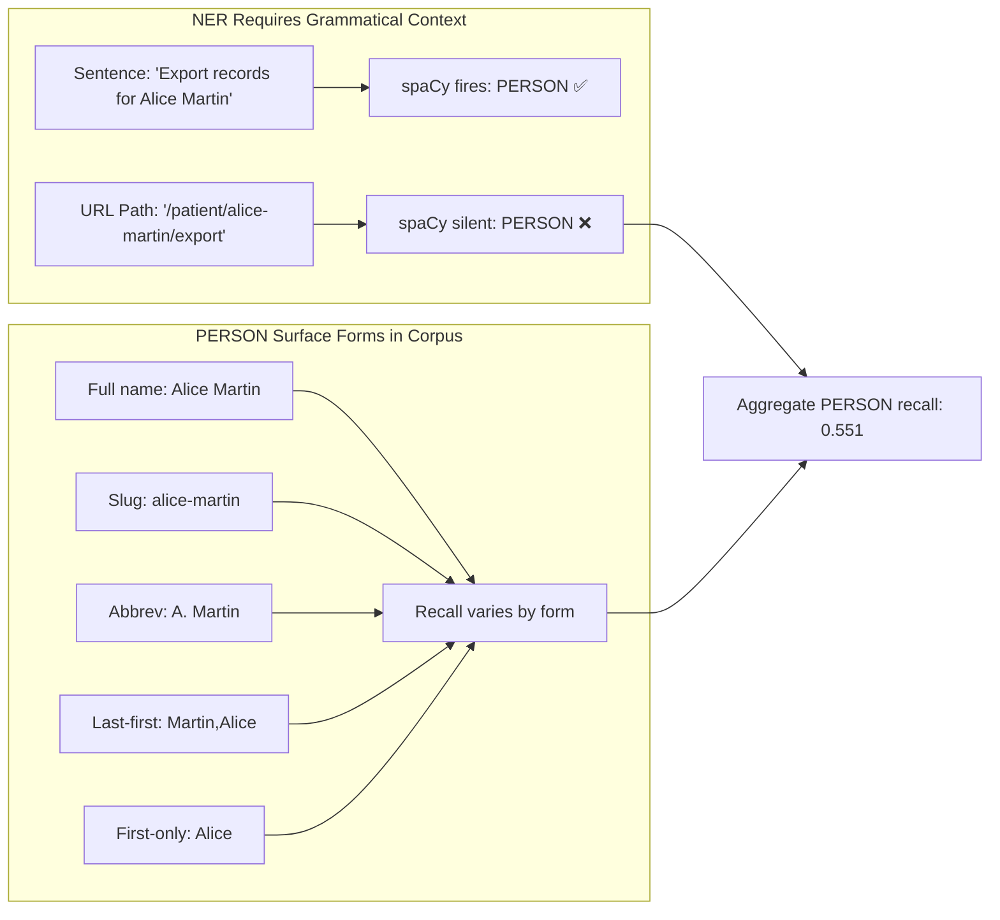
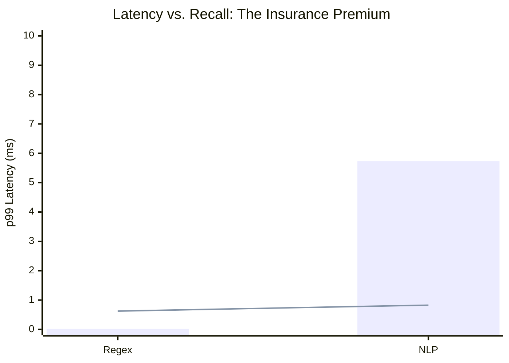

# 📈 Experimental Evaluation: 42-Configuration Parameter Sweep

## Experimental Design
```mermaid
graph LR
    subgraph Dimensions["Parameter Space (3D)"]
        D1[Detection Mode] --> D1a[regex]
        D1 --> D1b[nlp]
        D2[Entity Subset] --> D2a[6 individual types]
        D2 --> D2b[all 6 combined]
        D3[Confidence Threshold] --> D3a[min_score ∈ {0.3,0.4,0.5,0.6,0.7}]
    end
    
    Dimensions --> Configs[7 regex + 35 NLP = 42 configurations]
    Configs --> Corpus[Evaluated on 2,000-sample synthetic corpus]
    Corpus --> Metrics[Per-entity P/R/F1 + micro-averaged + latency]
```

## 🏆 Main Results: Regex vs. NLP (All Entities, min_score=0.4)

| Entity Type | Regex P/R/F1 | NLP P/R/F1 | Key Insight |
|-------------|--------------|------------|-------------|
| `EMAIL_ADDRESS` | 1.000 / 1.000 / 1.000 | 1.000 / 1.000 / 1.000 | Regex perfect for structural patterns |
| `IBAN_CODE` | 1.000 / 1.000 / 1.000 | 1.000 / 1.000 / 1.000 | Same |
| `CREDIT_CARD` | 1.000 / 1.000 / 1.000 | 1.000 / 1.000 / 1.000 | Same |
| `US_SSN` | 1.000 / 1.000 / 1.000 | 1.000 / 0.918 / 0.957 | NLP slight recall dip (confidence threshold) |
| `PHONE_NUMBER` | 1.000 / 0.781 / 0.877 | 1.000 / 1.000 / 1.000 | NLP recovers compact intl. format `+14155550182` |
| `PERSON` | 0.000 / 0.000 / 0.000 | 0.894 / 0.551 / 0.682 | **Critical**: Regex cannot detect names; NLP limited by URL context |
| **Micro-Avg** | **1.000 / 0.625 / 0.769** | **0.972 / 0.827 / 0.894** | **NLP adds 20pp recall at 5.71ms overhead** |

## 🎯 The PERSON Recall Ceiling: Why NLP Struggles with URLs



**Practical Implication**: Deployers treating NLP PERSON detection as fully reliable will miss ~45% of name-bearing tokens in URL path segments. For GDPR compliance, supplement with:
- Slug-aware preprocessing (split on `-`, `_`, `.` before NER)
- Domain-adapted NER fine-tuning on x402 metadata
- Manual review workflows for high-risk categories (medical/financial)

## ⚡ Latency: The Tradeoff Quantified



| Metric | Regex | NLP (Recommended) | Delta |
|--------|-------|-------------------|-------|
| p99 Latency | 0.02 ms | 5.73 ms | +5.71 ms |
| Micro Recall | 0.625 | 0.827 | +20.2 pp |
| PERSON Recall | 0.000 | 0.551 | +55.1 pp |
| Within 50ms Budget? | ✅ Yes | ✅ Yes (8.7× headroom) | — |

> 💡 **Key Takeaway**: *"For any deployment where a missed PERSON constitutes a compliance event, the extra 5.7ms is not a cost. It is an insurance premium, and a cheap one."*

## 🎯 Hypothesis Testing Results

| Hypothesis | Claim | Result | Outcome |
|------------|-------|--------|---------|
| **H1** | `resource_url` has highest PII injection rate | 45.3% of labels in URL field | ✅ Confirmed |
| **H2** | EMAIL+PERSON ≥70% of all entity labels | 72.5% (634 of 875) | ✅ Confirmed |
| **H3** | NLP adds PERSON recall over regex | R: 0.551 (NLP) vs. 0.000 (regex) | ✅ Confirmed |
| **H4** | Top-3 types capture ≥95% of full recall | Ratio=0.946 (<95%) | ❌ Refuted |
| **H5** | NLP overhead >50ms | NLP p99=5.73ms | ❌ Refuted |

**Recommendation**: Use all 6 entity types—PHONE_NUMBER's 2pp recall contribution costs negligible latency.
