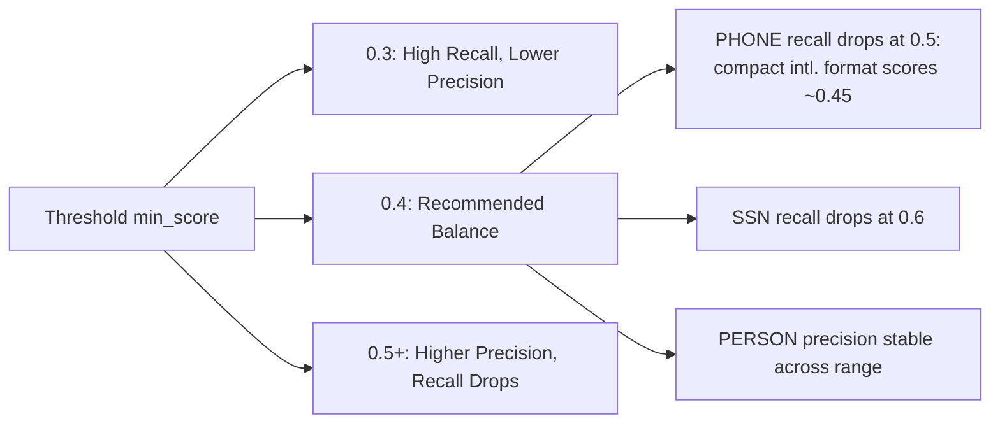

# 👨‍💻 Guide for Data Scientists & ML Engineers

## 🎯 Your Role: Implement, Tune, Monitor

You're responsible for:
- Integrating `presidio-hardened-x402` into agent workflows
- Tuning PII detection for your domain's metadata patterns
- Monitoring false positive/negative rates in production
- Extending entity recognizers for domain-specific PII

## ⚙️ Quick Start: Integration

### LangChain Adapter
```python
from presidio_hardened_x402 import HardenedX402Client
from langchain.agents import initialize_agent

# Drop-in replacement for Coinbase x402 client
client = HardenedX402Client(
    facilitator_address="0x...",
    pii_config={
        "mode": "nlp",
        "min_score": 0.4,
        "entities": ["EMAIL_ADDRESS", "PERSON", "US_SSN", "IBAN_CODE", "PHONE_NUMBER", "CREDIT_CARD"]
    },
    policy_config={
        "max_per_call_usd": 5.0,
        "daily_limit_usd": 50.0
    }
)

# Use in LangChain agent
agent = initialize_agent(
    tools=[...],
    llm=...,
    agent_type="zero-shot-react-description",
    handle_parsing_errors=True
)
# Agent now uses hardened client for all x402 payments
```

### CrewAI Adapter
```python
from crewai import Agent, Task, Crew
from presidio_hardened_x402.adapters.crewai import HardenedPaymentTool

# Custom tool with built-in hardening
payment_tool = HardenedPaymentTool(
    pii_threshold=0.4,
    policy_rules={"max_daily_spend": 100.0}
)

researcher = Agent(
    role="Research Agent",
    goal="Fetch paid data resources",
    tools=[payment_tool],
    # ... other config
)
```

## 🎚️ Tuning the PII Filter

### Confidence Threshold Sensitivity


**Actionable Guidance**:
1. Start with `min_score=0.4` (paper's recommendation)
2. Monitor false positives in audit logs: `{"control": "pii_filter", "outcome": "redacted"}`
3. If PERSON false positives exceed tolerance:
   - Add custom regex pre-filter for URL slugs: `r'/[a-z]+-[a-z]+/'`
   - Fine-tune spaCy model on your domain's URL patterns
4. If recall is insufficient:
   - Lower threshold to 0.3 (expect ~5-10% precision drop)
   - Add domain-specific Presidio recognizers

### Extending Entity Recognition
```python
from presidio_analyzer import RecognizerRegistry, PatternRecognizer

# Add custom recognizer for internal employee IDs
employee_id_recognizer = PatternRecognizer(
    supported_entity="EMPLOYEE_ID",
    patterns=[
        Pattern(name="emp_id_pattern", regex=r"EMP-\d{6}", score=0.95)
    ]
)

# Register with Presidio
registry = RecognizerRegistry()
registry.add_recognizer(employee_id_recognizer)

# Pass to HardenedX402Client
client = HardenedX402Client(
    pii_config={
        "mode": "nlp",
        "min_score": 0.4,
        "custom_registry": registry  # ← Your extended recognizers
    }
)
```

## 📊 Monitoring in Production

### Key Metrics to Track
| Metric | Target | Alert Threshold | Why It Matters |
|--------|--------|-----------------|---------------|
| PII detection rate | ~36% (corpus estimate) | <20% or >50% | Drift in metadata PII prevalence |
| PERSON recall (estimated) | ≥0.50 | <0.40 | GDPR exposure risk |
| False positive rate | ≤5% | >10% | User experience degradation |
| p99 latency | ≤10ms | >25ms | Agent workflow performance |
| Policy block rate | Domain-dependent | Sudden spikes | Potential attack or misconfiguration |

### Audit Log Query Examples (Elasticsearch)
```json
// Find all redactions by entity type
{
  "query": {
    "bool": {
      "must": [
        {"term": {"controls.pii_filter.status": "redacted"}},
        {"range": {"timestamp": {"gte": "now-24h"}}}
      ]
    }
  },
  "aggs": {
    "by_entity": {
      "terms": {"field": "controls.pii_filter.entities.keyword"}
    }
  }
}

// Detect replay attempt spikes
{
  "query": {
    "bool": {
      "must": [
        {"term": {"controls.replay_guard.status": "blocked"}},
        {"range": {"timestamp": {"gte": "now-1h"}}}
      ]
    }
  }
}
```

## 🚨 Troubleshooting Common Issues

| Symptom | Likely Cause | Fix |
|---------|-------------|-----|
| PERSON entities not redacted in URLs | NLP context loss in slug format | Add slug preprocessor: split on `-`/`_` before NER |
| High false positives on service names | NER overfires on generic nouns | Raise `min_score` to 0.5; add negative examples to custom recognizer |
| Latency spikes >50ms | Redis ReplayGuard network timeout | Configure fallback to in-memory store; increase Redis timeout |
| Policy blocks legitimate payments | Overly restrictive `max_per_endpoint_usd` | Review policy config; add endpoint to whitelist |

## 🔬 Advanced: Adversarial Robustness (Future Work)
The current filter doesn't handle:
- Base64-encoded PII in metadata
- Unicode homoglyph attacks (`а` vs `a`)
- Split-token obfuscation

**Mitigation until v0.3.0**:
```python
# Pre-scan for obfuscation patterns
def detect_obfuscation(text: str) -> bool:
    return (
        bool(re.search(r'[A-Za-z0-9+/]{20,}={0,2}', text)) or  # Base64
        any(ord(c) > 127 for c in text) or  # Non-ASCII homoglyphs
        len(text) > 500  # Suspiciously long metadata
    )

# Integrate into PIIFilter
if detect_obfuscation(metadata_field):
    emit_audit_event("SUSPICIOUS_METADATA", action="block")
    raise SecurityException("Potential obfuscation detected")
```
