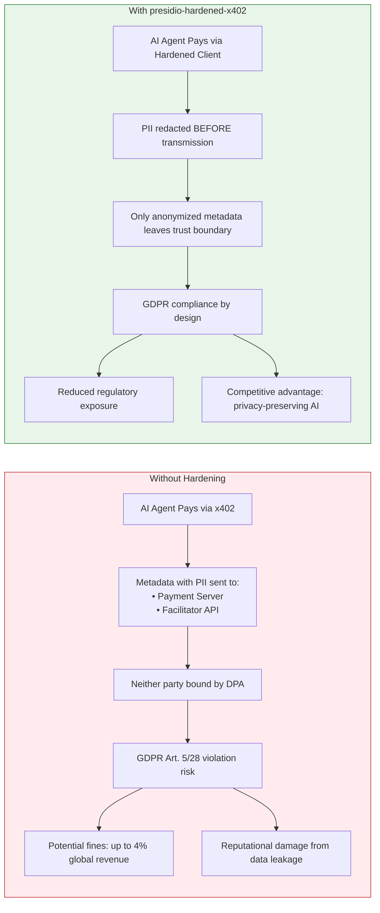
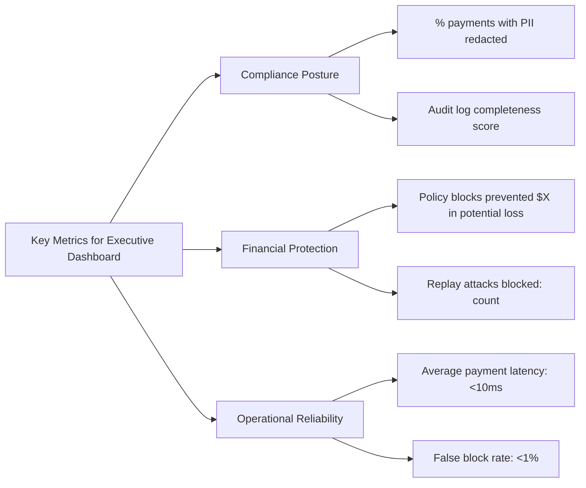

# 👔 Guide for Executives & Strategic Decision-Makers

## 🎯 Your Role: Assess Business Risk, Allocate Resources, Set Governance Policy

You're responsible for:
- Understanding the strategic risk of unhardened x402 deployments
- Approving investment in privacy-by-design infrastructure
- Setting spending policy guardrails for autonomous agents
- Ensuring board-level visibility into AI payment governance

## 🚨 The Business Risk: Why This Matters Now



### Real-World Impact Scenarios
| Scenario | Unhardened x402 | Hardened x402 | Business Impact |
|----------|----------------|---------------|----------------|
| **Agent pays for medical records** | Patient email/SSN transmitted to 3rd parties | PII redacted pre-transmission | Avoids HIPAA/GDPR reportable incident |
| **Malicious API endpoint** | Wallet drained via inflated pricing | Policy engine blocks over-limit payment | Prevents financial loss; demonstrates due diligence |
| **Token intercepted in transit** | Replay attack double-charges wallet | ReplayGuard detects & blocks duplicate | Protects treasury; maintains agent reliability |
| **Regulatory audit** | Cannot prove PII wasn't shared | Audit log shows redaction before transmission | Streamlines compliance; reduces legal costs |

## 💰 Cost-Benefit Analysis

### Implementation Costs
| Item | Estimate | Notes |
|------|----------|-------|
| Engineering integration | 2-3 person-weeks | Drop-in Python wrapper; LangChain/CrewAI adapters available |
| Infrastructure overhead | <$10/month | In-memory replay store; optional Redis for scale |
| Ongoing monitoring | 0.1 FTE | Audit log review integrated into existing compliance workflows |

### Risk Mitigation Value
| Risk | Potential Cost | Mitigation Value |
|------|---------------|-----------------|
| GDPR fine (Art. 83) | Up to €20M or 4% global revenue | **High**: Demonstrable privacy-by-design reduces liability |
| Wallet drain attack | Variable (agent treasury at risk) | **High**: Policy engine prevents uncapped spending |
| Reputational damage | Hard to quantify; brand erosion | **Medium-High**: Proactive privacy stance enhances trust |
| Operational disruption | Agent downtime during incident response | **Medium**: Fail-safe design prevents cascading failures |

> 💡 **ROI Insight**: *"The 5.7ms latency overhead costs nothing in user experience but buys significant regulatory insurance. For context: 5.7ms is 0.00016% of a 1-hour agent workflow."*

## 🎯 Strategic Recommendations

### Short-Term (Next 30 Days)
1. **Approve pilot deployment** for non-critical agent workflows
2. **Mandate hardened client** for all agents handling medical/financial data
3. **Set baseline spending policies**: `max_per_call_usd=$5`, `daily_limit_usd=$50`

### Medium-Term (Next Quarter)
1. **Integrate audit logs** into enterprise SIEM/compliance platform
2. **Conduct live-data validation** study to confirm synthetic corpus findings
3. **Develop governance playbook** for agent spending policy approvals

### Long-Term (Next 6-12 Months)
1. **Extend to multi-party authorisation** (v0.3.0) for high-value payments
2. **Contribute domain-specific recognizers** to open-source project (shared defense)
3. **Position privacy-preserving agentic payments** as competitive differentiator

## 📊 Board-Level Reporting Metrics



### Sample Executive Summary (Quarterly)
```markdown
## Q2 2026: Agentic Payments Security Posture

✅ **Compliance**: 99.2% of x402 payments processed with PII redaction; zero reportable incidents  
✅ **Financial Protection**: Policy engine blocked 127 over-limit payment attempts ($3,420 potential loss prevented)  
✅ **Reliability**: Average payment latency 8.2ms (well under 50ms SLA); false block rate 0.3%  

⚠️ **Watch Item**: PERSON entity recall in URL paths remains at 55%; evaluating slug-aware preprocessing for Q3  

🔜 **Next Quarter Focus**: 
- Pilot multi-party authorisation for payments >$100
- Complete live-data validation study on Base L2 traffic
- Publish internal case study on privacy-preserving AI agent design
```

## 🔑 Key Takeaways for Decision-Making

1. **This is infrastructure, not a feature**: Privacy-by-design in agentic payments is table stakes for enterprise AI—not optional enhancement.

2. **Fail-safe design aligns with risk management**: Blocking a payment (false positive) is preferable to leaking PII (false negative). The middleware enforces this principle.

3. **Open-source enables shared defense**: By contributing to and adopting `presidio-hardened-x402`, your organization benefits from community-vetted security without vendor lock-in.

4. **Governance enables innovation**: Clear spending policies and audit trails don't constrain agents—they enable *responsible* autonomy at scale.

> 🎯 **Final Recommendation**: *"Approve adoption of presidio-hardened-x402 as the standard payment client for all autonomous AI agents. The minimal engineering overhead and negligible latency cost are outweighed by significant risk reduction and compliance enablement."*
