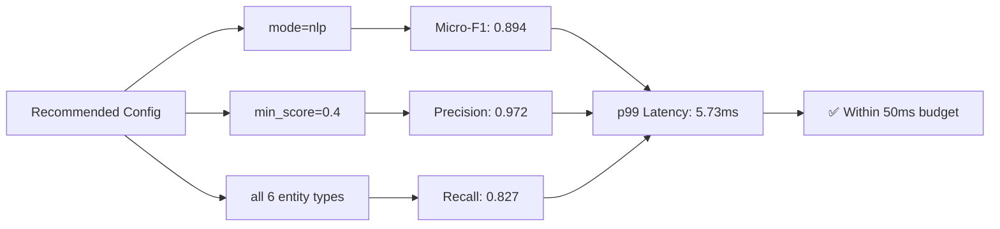

# 🔐 presidio-hardened-x402: Research Notes

> **Paper**: Hardening x402: PII-Safe Agentic Payments via Pre-Execution Metadata Filtering  
> **Author**: Vladimir Stantchev (SRH University Heidelberg / PRESIDIO Group)  
> **Date**: April 13, 2026 | **arXiv**: 2604.11430v1 [cs.CR]

## 🎯 One-Sentence Summary
An open-source middleware that intercepts x402 AI agent payment requests *before transmission* to redact PII, enforce spending policies, and prevent replay attacks—achieving 89.4% micro-F1 at 5.73ms p99 latency.

## 🧭 Navigation by Audience

| Audience | Start Here | Key Questions Answered |
|----------|-----------|----------------------|
| **Executives** | [`04-audience-guides/for-executives.md`](04-audience-guides/for-executives.md) | What's the business risk? What's the cost of implementation? How does this affect compliance posture? |
| **Compliance Officers** | [`04-audience-guides/for-compliance-officers.md`](04-audience-guides/for-compliance-officers.md) | How does this satisfy GDPR Art. 5/28? What audit trails are generated? What's the data minimisation proof? |
| **Data Scientists / Engineers** | [`04-audience-guides/for-data-scientists.md`](04-audience-guides/for-data-scientists.md) | How do I tune the PII filter? What's the latency overhead? How do I integrate with LangChain/CrewAI? |
| **Security Researchers** | [`02-technical-deep-dive/threat-model.md`](02-technical-deep-dive/threat-model.md) | What attack vectors are mitigated? What's the threat model? What's out of scope? |

## 📊 Key Metrics at a Glance

## 🔗 Quick Links
- [📦 GitHub Repository](https://github.com/presidio-v/presidio-hardened-x402)
- [🧪 Synthetic Corpus (2,000 samples)](03-evaluation/corpus-construction.md)
- [⚙️ Configuration Recipes](06-appendices/configuration-recipes.md)

---
*These notes are structured for progressive disclosure: start with your audience guide, then drill into technical details as needed.*
